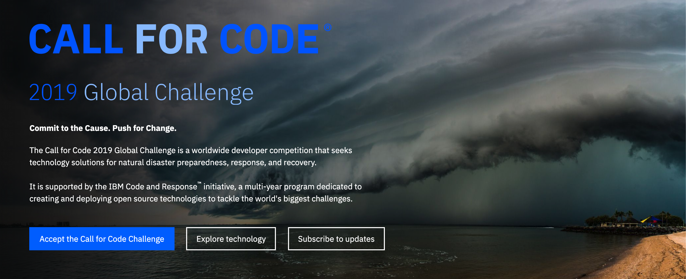
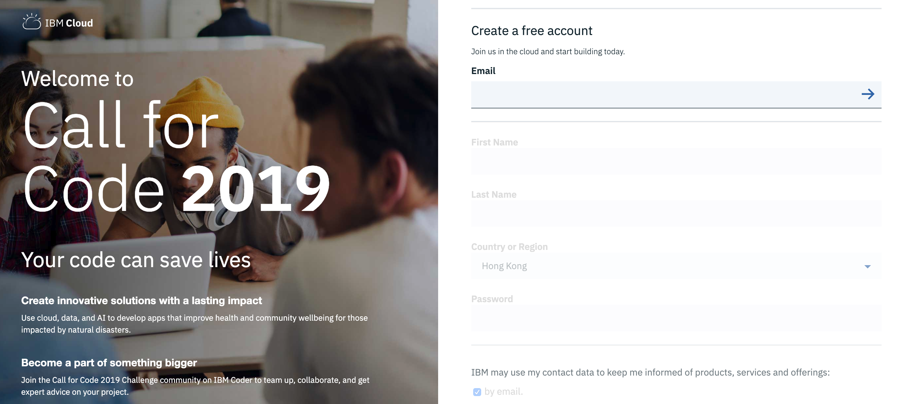
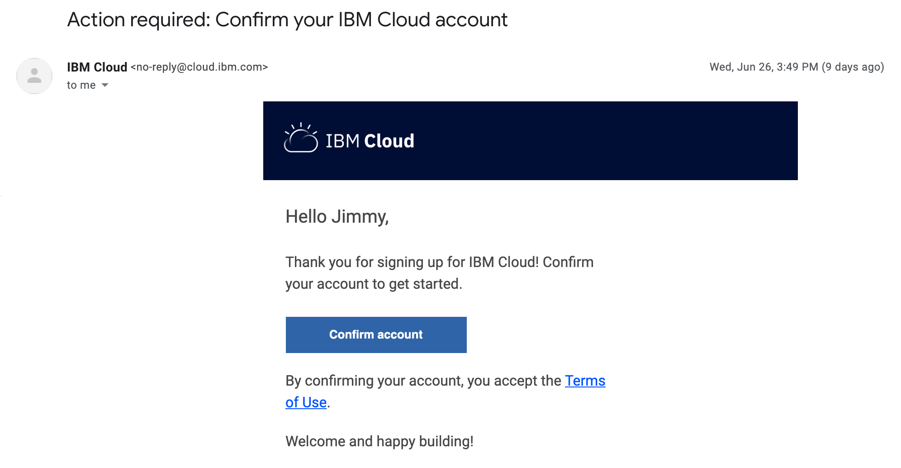
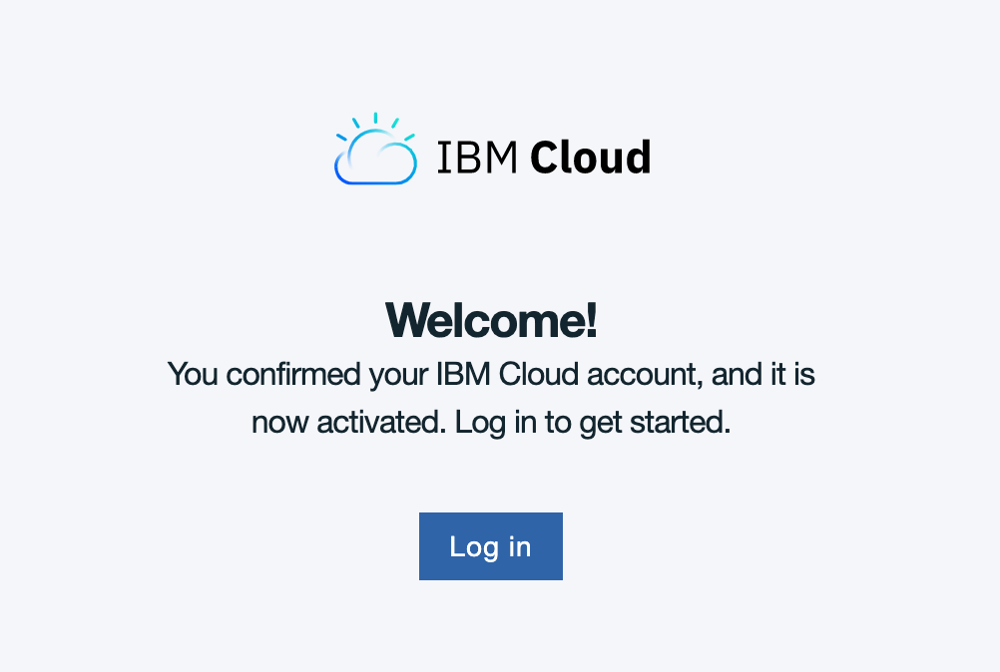
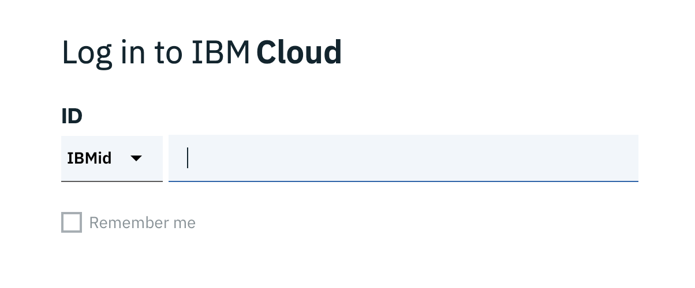

# Lab 0 - Register for IBM Cloud

_Instructors 1._ [_Isaias Rafael Jr Burao \(Ira\) Angeles_](mailto:isaias@sg.ibm.com) _\(Client Developer Advocate\)_

                    _2._ [_Nuttapong Wong-aree_](mailto:wonganut@sg.ibm.com) _\(Client Developer Advocate\)_

                    _3._ [_Zack ZY Yeo_ ](mailto:zackyeo@sg.ibm.com)_\(AP Digital Strategy \| Developer Advocacy & Business Development\)_

If you are an existing IBM Cloud user, please skip this process.   


if you are new to IBM Cloud, [click here to sign up for a free account on IBM Cloud](https://cloud.ibm.com/registration/whitelist)

Alternatively, please proceed with the following steps:

Access the Call for Code page at: [http://www.ibm.biz/callforcodeAP](http://www.ibm.biz/callforcodeAP)



Click on the **blue** button 

```text
Accept the Call for Code Challenge
```



Follow the steps accordingly and do remember to check the **checkbox** for IBM consultants to reach out to you in the future for support

```text
IBM may use my contact data to keep me informed of products, services and offerings
```

Kindly wait for a confirmation email to be sent to the email address you registered with!



Validate the account by clicking on the **Confirm account** button.

Congratulations! You have activated your IBM Cloud account.   
PS: Note that almost all services are available to explore at the Lite Version. 



Click onto **Log in** button to start exploring 

Do not be alarmed, IBMid refers to the email address you have used to sign-up for IBM Cloud \(i.e. gmail, outlook, corporate domain, etc\) 



Useful link : IBM Code Pattern - [https://developer.ibm.com/patterns](https://developer.ibm.com/patterns)

