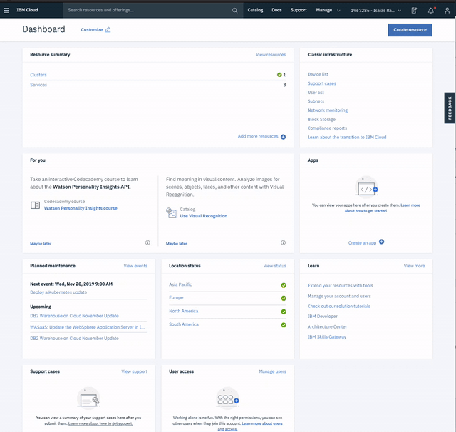
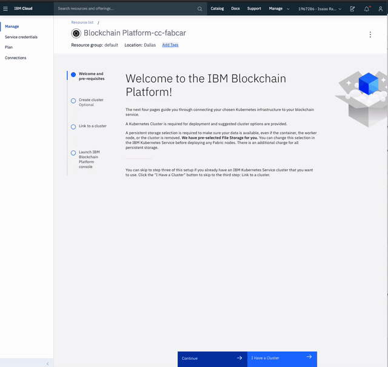

# Lab 3: FabCar Blockchain Sample - IBM Blockchain Platform Creation

* Create the [IBM Blockchain Platform](https://console.bluemix.net/catalog/services/blockchain/) service on the IBM Cloud. You can find the service in the `Catalog`, and give a name.

* After your kubernetes cluster is up and running, you can deploy your IBM Blockchain Platform on the cluster. The service walks through few steps and finds your cluster on the IBM Cloud to deploy the service on.

* Once the Blockchain Platform is deployed on the Kubernetes cluster, you can launch the console to start operating on your blockchain network.

* Start IBM Blockchain Platform Console

