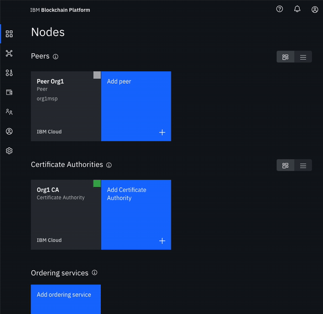
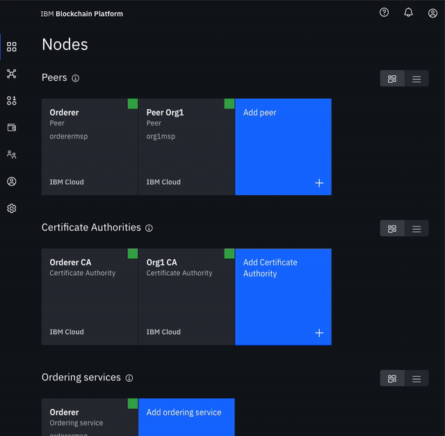

# Lab 4b: FabCar Blockchain Sample - Build a Network \(2/3\)

### Create the node that orders transactions

* **Create your orderer organization CA**
  * Click **Add Certificate Authority**.
  * Click **IBM Cloud** under **Create Certificate Authority** and **Next**.
  * Give it a unique **Display name** of `Orderer CA`.
  * Specify an **Admin ID** of `admin` and **Admin Secret** of `adminpw`.

* **Use your CA to register orderer and orderer admin identities**
  * In the **Nodes** tab, select the **Orderer CA** Certificate Authority that we created.
  * First, we will register an admin for our organization. Click on the **Register User** button. Give an **Enroll ID** of `ordereradmin`, and **Enroll Secret** of `ordereradminpw`. Click **Next**. Set the **Type** for this identity as `client` and select from any of the affiliated organizations from the drop-down list. We will leave the **Maximum enrollments** and **Add Attributes** fields blank.
  * We will repeat the process to create an identity of the orderer. Click on the **Register User** button. Give an **Enroll ID** of `orderer1`, and **Enroll Secret** of `orderer1pw`. Click **Next**. Set the **Type** for this identity as `peer` and select from any of the affiliated organizations from the drop-down list. We will leave the **Maximum enrollments** and **Add Attributes** fields blank.

* **Create the orderer organization MSP definition**
  * Navigate to the **Organizations** tab in the left navigation and click **Create MSP definition**.
  * Enter the **MSP Display name** as `Orderer MSP` and an **MSP ID** of `orderermsp`.
  * Under **Root Certificate Authority** details, specify the peer CA that we created `Orderer CA` as the root CA for the organization.
  * Give the **Enroll ID** and **Enroll secret** for your organization admin, `ordereradmin` and `ordereradminpw`. Then, give the **Identity name**, `Orderer Admin`.
  * Click the **Generate** button to enroll this identity as the admin of your organization and export the identity to the wallet. Click **Export** to export the admin certificates to your file system. Finally click **Create MSP definition**.

* **Create an orderer**
  * On the **Nodes** page, click **Add orderering service**.
  * Click **IBM Cloud** and proceed with **Next**.
  * Give your peer a **Display name** of `Orderer`.
  * On the next screen, select `Orderer CA` as your **Certificate Authority**. Then, give the **Enroll ID** and **Enroll secret** for the peer identity that you created for your orderer, `orderer1`, and `orderer1pw`. Then, select the **Administrator Certificate \(from MSP\)**, `Orderer MSP`, from the drop-down list and click **Next**.
  * Give the **TLS Enroll ID**, `admin`, and **TLS Enroll secret**, `adminpw`, the same values are the Enroll ID and Enroll secret that you gave when creating the CA. Leave the **TLS CSR hostname** blank.
  * The last side panel will ask to **Associate an identity** and make it the admin of your peer. Select your peer admin identity `Orderer Admin`.
  * Review the summary and click **Submit**.

* **Add organization as Consortium Member on the orderer to transact**
  * Navigate to the **Nodes** tab, and click on the **Orderer** that we created.
  * Under **Consortium Members**, click **Add organization**.
  * From the drop-down list, select `Org1 MSP`, as this is the MSP that represents the peer's organization org1.
  * Click **Submit**.

