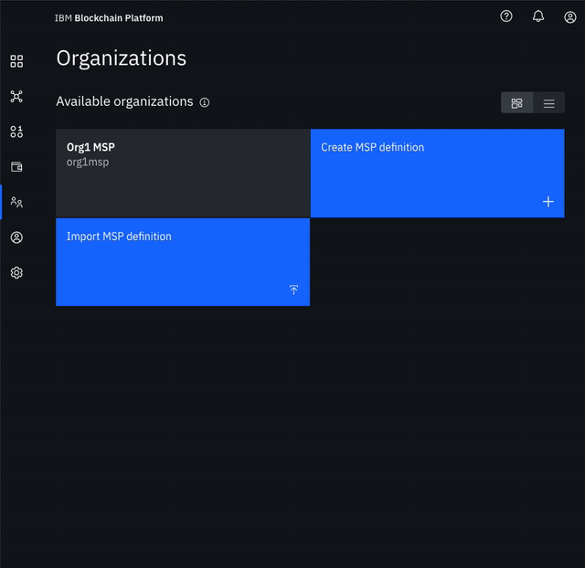

# Lab 4a: FabCar Blockchain Sample - Build a Network \(1/3\)

### Create your organization and your entry point to your blockchain

* **Create your peer organization CA**
  * Click **Add Certificate Authority**.
  * Click **IBM Cloud** under **Create Certificate Authority** and **Next**.
  * Give it a **CA display name** of `Org1 CA`.
  * Specify an **Admin ID** of `admin` and **Admin Secret** of `adminpw`.

* **Use your CA to register identities**
  * In **Nodes** Select the **Org 1 CA** Certificate Authority that we created.
  * First, we will register an admin for our organization "org1". Click on the **Register User** button. Give an **Enroll ID** of `org1admin`, and **Enroll Secret** of `org1adminpw`. Click **Next**. Set the **Type** for this identity as `client` and select from any of the affiliated organizations from the drop-down list. We will leave the **Maximum enrollments** and **Add Attributes** fields blank.
  * We will repeat the process to create an identity of the peer. Click on the **Register User** button. Give an **Enroll ID** of `peer1`, and **Enroll Secret** of `peer1pw`. Click **Next**. Set the **Type** for this identity as `peer` and select from any of the affiliated organizations from the drop-down list. We will leave the **Maximum enrollments** and **Add Attributes** fields blank.

* **Create the peer organization MSP definition**
  * Navigate to the **Organizations** tab in the left navigation and click **Create MSP definition**.
  * Enter the **MSP Display name** as `Org1 MSP` and an **MSP ID** of `org1msp`.
  * Under **Root Certificate Authority** details, specify the peer CA that we created `Org1 CA` as the root CA for the organization.
  * Give the **Enroll ID** and **Enroll secret** for your organization admin, `org1admin` and `org1adminpw`. Then, give the Identity name, `Org1 Admin`.
  * Click the **Generate** button to enroll this identity as the admin of your organization and export the identity to the wallet. Click **Export** to export the admin certificates to your file system. Finally click **Create MSP definition**.

* **Create a peer**
  * On the **Nodes** page, click **Add peer**.
  * Click **IBM Cloud peer** under Create a new peer and **Next**.
  * Give your peer a **Display name** of `Peer Org1`.
  * On the next screen, select `Org1 CA` as your **Certificate Authority**. Then, give the **Enroll ID** and **Enroll secret** for the peer identity that you created for your peer, `peer1`, and `peer1pw`. Then, select the **Administrator Certificate \(from MSP\)**, `Org1 MSP`, from the drop-down list and click **Next**.
  * Give the **TLS Enroll ID**, `admin`, and **TLS Enroll secret**, `adminpw`, the same values are the Enroll ID and Enroll secret that you gave when creating the CA. Leave the **TLS CSR hostname** blank.
  * The last side panel will ask you to **Associate an identity** and make it the admin of your peer. Select your peer admin identity `Org1 Admin`.
  * Review the summary and click **Submit**.

