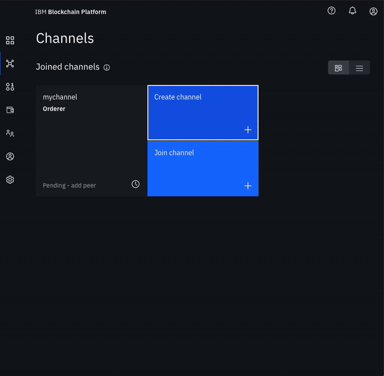

# Lab 4c: FabCar Blockchain Sample - Build a Network \(3/3\)

* **Create the channel**
  * Navigate to the **Channels** tab in the left navigation.
  * Click **Create channel**.
  * Give the channel a name, `mychannel`.
  * Select the orderer you created, `Orderer` from the orderers drop-down list.
  * Select the channel member under the Organization section, This should be `Org1 MSP (org1msp)`.
  * Select the MSP identifying the organization of the channel creator from the drop-down list. This should be `Org1 MSP (org1msp)`.
  * Click **Add** next to your organization. Make your organization an **Operator**.
  * Select identity under the Channel creator organization section as `Org1 Admin`.
  * Click **Create channel**.

* **Join your peer to the channel**
  * Click **Join channel** to launch the side panels.
  * Select your `Orderer` and click **Next**.
  * Enter the name of the channel you just created. `mychannel` and click **Next**.
  * Select which peers you want to join the channel, click `Peer Org1` .
  * Click **Join Channel**.

