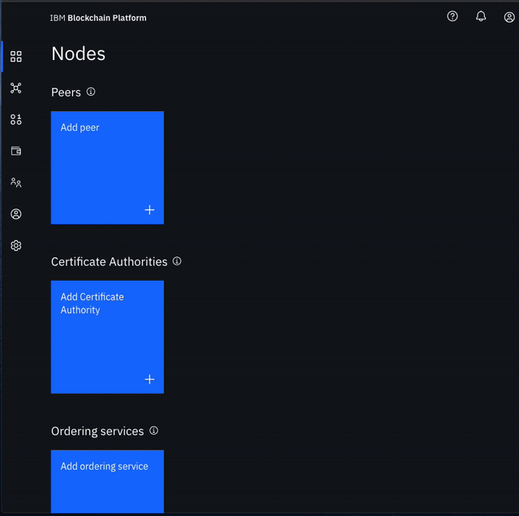
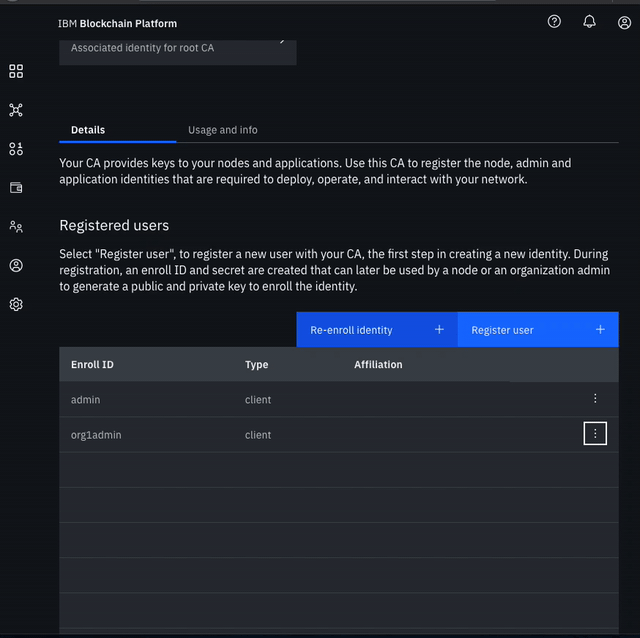

# Lab 4: FabCar Blockchain Sample - Build a Network

## Structure of the Network

We will build a network as provided by the IBM Blockchain Platform [documentation](https://console.bluemix.net/docs/services/blockchain/howto/ibp-console-build-network.html#ibp-console-build-network). This will include creating a channel with a single peer organization with its own MSP and CA \(Certificate Authority\), and an orderer organization with its own MSP and CA. We will create the respective identities to deploy peers and operate nodes.

### Create your organization and your entry point to your blockchain

* **Create your peer organization CA**
  * Click **Add Certificate Authority**.
  * Click **IBM Cloud** under **Create Certificate Authority** and **Next**.
  * Give it a **Display name** of `Org1 CA`.
  * Specify an **Admin ID** of `admin` and **Admin Secret** of `adminpw`.

* **Use your CA to register identities**
  * Select the **Org 1 CA** Certificate Authority that we created.
  * First, we will register an admin for our organization "org1". Click on the **Register User** button. Give an **Enroll ID** of `org1admin`, and **Enroll Secret** of `org1adminpw`. Click **Next**. Set the **Type** for this identity as `client` and select from any of the affiliated organizations from the drop-down list. We will leave the **Maximum enrollments** and **Add Attributes** fields blank.
  * We will repeat the process to create an identity of the peer. Click on the **Register User** button. Give an **Enroll ID** of `peer1`, and **Enroll Secret** of `peer1pw`. Click **Next**. Set the **Type** for this identity as `peer` and select from any of the affiliated organizations from the drop-down list. We will leave the **Maximum enrollments** and **Add Attributes** fields blank.

