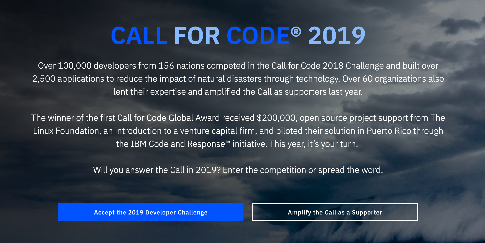
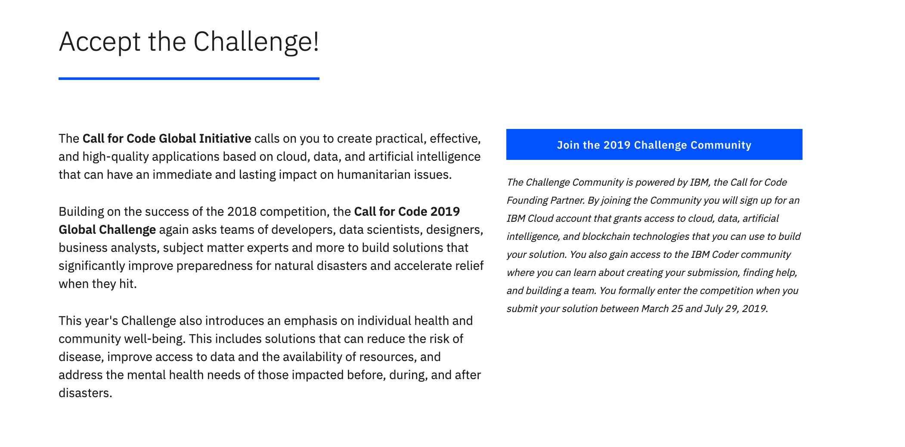
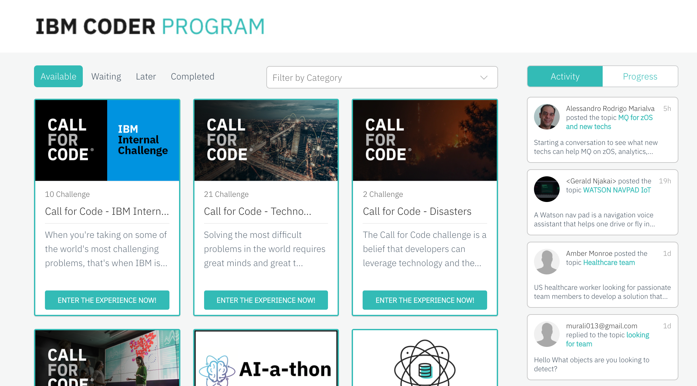

# Lab 1 - Answer the Call for Code

#### To be at this page, you should already have a functional IBM Cloud account. If not, kindly proceed to Lab 0.

Please use the following link: [https://callforcode.org/](https://callforcode.org/).   
This should be the second time you see this page \(if you came here after Lab 0\)  
But please follow accordingly!

Accept the challenge by clicking on the blue button

By clicking onto the blue button, you will be led into our Coder Platform - where you will go through a series of modules to 1\) understand the CFC mission, 2\) pick up a skill or two with IBM Code Pattern and 3\) Submit your solution to join the global challenge! 

By logging in, you will be routed to the IBM Coder! 

For those who are experienced and already have a finished solution ready for submission, please use the following link: [https://callforcode.org/submit/](https://callforcode.org/submit/).

Thank you for your contributions! 

Useful link : IBM Code Pattern - [https://developer.ibm.com/patterns](https://developer.ibm.com/patterns)

