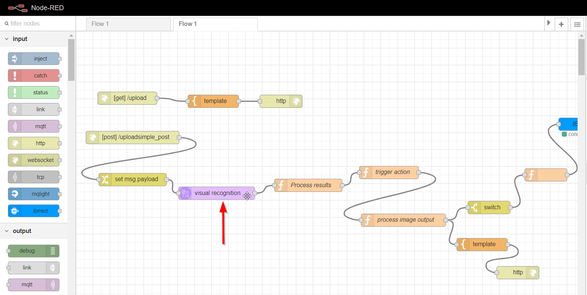

# Lab 2 - Forest Fire Detection Using Visual Recognition

## Fire Alarm using Watson Visual Recognition

This project is a how-to guide on using Watson Visual Recognition service to analyse an image and based on a trigger word then send a event command to IoT Device.In this example node-red is used to create an image upload form which sends the image to Watson Visual Recognition and trigger an IoT device whenever fire is detected in the image. [Click here to try what we're going to build.](https://nodered-iotimageanalysis001.mybluemix.net/upload)

## NOTE: Please check the Video Tutorial at the bottom of the page if you face any issues! 

1. Login/signup in to your [IBM Cloud Account](https://ibm.biz/BdYtcs)

2. Go to Catalog and create the following services:

* \*\*\*\*[**Internet of Things Platform Starter**](https://cloud.ibm.com/catalog/starters/internet-of-things-platform-starter)\*\*\*\*

\(Alternatively, You can browse through IBM Cloud's Catalog &gt; Starter Kits &gt; Internet of Things Platform Starter\)

     - Input the App Name, in this example, use "NodeRed-IotImageAnalysis" and click create button.  \(Please suffix the App Name with your desired 4 random numbers\)

    - While IBM Cloud creating the Cloud Foundry App for you, we can monitor its status from the [resource dashboard](https://cloud.ibm.com/resources) . Once we see the App is up running, click on the app and a new window will pop on the right hand side. 

* [Visual Recognition](https://cloud.ibm.com/catalog/services/visual-recognition)

\(Alternatively, You can browse through IBM Cloud's Catalog &gt; AI &gt; Visual Recognition\)

At this point, 2 services have been created, next step is to link these 2 services by using the API Key generated and the JSON file which is available on [github](https://github.com/krishnac7/IotImageAnalysis).

Now, go back to Node-RED Flow that we leave it open.

Now, the 2 services are linked and up running and it's time to run the application. Back to IBM's Catalog and look for Cloud Foundry App which has been created at the first step. Look for Route's link, It may look like   
  
[https://nodered-iotimageanalysis001.mybluemix.net](https://nodered-iotimageanalysis001.mybluemix.net)

In order to run the application, please suffix the Route's URL with "/upload".

### Please use the [Video Tutorial](https://github.com/krishnac7/Media/blob/master/IotImageAnalysis/imageAnalysisIot.mp4) if you still have problem troubleshooting! 

#### Github repository:  [https://github.com/krishnac7/IotImageAnalysis](https://github.com/krishnac7/IotImageAnalysis)

Useful link : IBM Code Pattern - [https://developer.ibm.com/patterns](https://developer.ibm.com/patterns)

